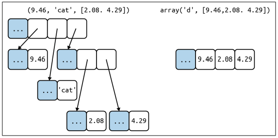

# Data Types

Kiểu dữ liệu là sự phân lớp hoặc phân loại các mục dữ liệu. Nó đại diện cho loại giá trị cho biết những thao tác nào có thể được thực hiện trên một dữ liệu cụ thể. Vì mọi thứ đều là một đối tượng trong lập trình Python, nên các kiểu dữ liệu thực sự là các lớp và các biến
số là sự thể hiện (đối tượng) của các lớp này.


Trong Python, mọi thứ đều là một đối tượng. Đối tượng là các thực thể hoặc giá trị cơ bản trong Python. Mỗi đối tượng có một kiểu. Các loại có thể có là vô hướng hoặc không vô hướng.

## Scalar

Các giá trị có kiểu vô hướng là giá trị nguyên tử hoặc không thể phân chia. Chúng không thể chia cắt theo nghĩa đen nhưng người ta nên tránh chúng ra.

Đại diện cho kiểu dữ liệu vô hướng là Numeric, Boolean và kiểu NoneType.

* Numeric: Trong Python, kiểu dữ liệu số đại diện cho dữ liệu có giá trị số. Giá trị số có thể là số nguyên, số thực hoặc thậm chí số phức. Các giá trị này được định nghĩa là *int*, *float* và *complex* trong Python.
  * Integers - Giá trị này được đại diện bởi lớp *int*. Nó chứa các số nguyên dương hoặc âm (không có phân số hoặc thập phân). Trong Python, không có giới hạn về độ dài của một giá trị số nguyên.

        ```python
        >> a = 120
        >> type(a)
        <class 'int'>
        ```

  * Float - Giá trị này được đại diện bởi lớp float. Nó là một số thực với biểu diễn dấu phẩy động. Nó được chỉ định bằng một dấu thập phân. Theo tùy chọn, ký tự e hoặc E theo sau là số nguyên dương hoặc âm có thể được thêm vào để chỉ định ký hiệu khoa học.

        ```python
        >> b = 1.2e2
        >> b
        120
        >> type(b)
        <class 'float'>
        ```

  * Complex Numbers - Số phức được biểu diễn bằng lớp phức. Nó được chỉ định là (phần thực) + (phần ảo) j.

        ```python
        >> c = -2 + 3j
        >> type(c)
        <class 'complex'>
        ```

* Boolean: kiểu dữ liệu có một trong hai giá trị cài sẵn True hoặc False. Các đối tượng Boolean bằng True là đúng và các đối tượng bằng False là sai. Nhưng các đối tượng không phải Boolean cũng có thể được đánh giá trong ngữ cảnh Boolean và được xác định là đúng hay sai. Nó được ký hiệu bởi *bool*.

    ```python
    >> d = True
    >> type(d)
    <class 'bool'>
    >> bool(2)
    True
    >> bool(0)
    False
    ```

* NoneType: Trong Python, không có từ khóa Null, nhưng có None. None là giá trị trả về của hàm “không trả về bất kỳ thứ gì”. NoneType là một loại Đối tượng None trong Python. Từ khóa None là một đối tượng, một kiểu dữ liệu của lớp NoneType. Chúng ta có thể gán None cho bất kỳ biến nào, nhưng chúng ta không thể tạo các đối tượng NoneType khác. NoneType chỉ đơn giản là kiểu của thẻ đơn Không có.

    ```python
    >> e = None
    >> type(e)
    <class 'NoneType'>
    ```

## Compound

Kiểu dữ liệu phức hợp cung cấp các cách tổ chức và quản lý các giá trị dữ liệu của bất kỳ kiểu dữ liệu nào. Không có hằng số cho kiểu dữ liệu phức hợp; các giá trị dữ liệu thực tế chứa trong một biến của kiểu dữ liệu phức hợp sẽ luôn thuộc một hoặc nhiều kiểu dữ liệu cơ bản.

Đại diện cho kiểu dữ liệu vô hướng là Sequence Type, Dictionary và Set.

* Sequence Type: Trong Python, sequence là tập hợp có thứ tự của các kiểu dữ liệu giống nhau hoặc khác nhau. Sequence cho phép lưu trữ nhiều giá trị theo cách có tổ chức và hiệu quả. Có một số kiểu sequence trong Python là *List*, *String*, *Tuple*.

  * String - Trong Python, string là các mảng byte đại diện cho các ký tự Unicode. Chuỗi là một tập hợp của một hoặc nhiều ký tự được đặt trong một dấu ngoặc kép, dấu ngoặc kép hoặc dấu ngoặc kép. Trong Python không có kiểu dữ liệu ký tự, một ký tự là một chuỗi có độ dài là một. Nó được đại diện bởi *str*.

        ```python
        >> f = 'String'
        >> type(f)
        <class 'str'>
        ```

    * Truy cập các phần tử của string: các ký tự riêng lẻ của một chuỗi có thể được truy cập bằng cách sử dụng phương pháp Lập chỉ mục. Lập chỉ mục cho phép các tham chiếu địa chỉ phủ định truy cập các ký tự từ phía sau của Chuỗi, ví dụ -1 đề cập đến ký tự cuối cùng, -2 đề cập đến ký tự cuối cùng thứ hai, v.v.

            

    * Thay đổi hoặc xóa string: Các string không thể thay đổi vì chúng là cố định.

            ```python
            >> f1 = 'String'
            >> f1[0] = 'A'
            TypeError: 'str' object does not support item assignment
            ```

            Nếu cần một string khác, cách tốt nhất là tạo mới:

            ```python
            >> f2 = 'A' + f1[2:]
            >> f2
            Atring
            ```

            Không thể xóa hay loại bỏ ký tự khỏi string, nhưng có thể xóa toàn bộ:

            ```python
            >> del f2
            >> f2
            NameError: name 'f2' is not defined
            ```

    * Nối string: bằng toán tử $+$ và thay thế bằng $*$, Hai hoặc nhiều ký tự dạng chuỗi (tức là ký tự trong dấu nháy) cạnh nhau.

            ```python
            >> 3 * 'un' + 'ium'
            unununium
            >> 'Py' 'thon'
            Python
            >> f3 = 'Py'
            >> f3 'thon'
            SyntaxError: invalid syntax
            >> ('un' * 3) 'ium'
            SyntaxError: invalid syntax
            >> prefix + 'thon'
            Python
            ```

    * Các hàm phổ biến để làm việc với string:

            ```python
            len() -> trả về độ dài của string
            enumerate() -> trả về đối tượng liệt kê, chứa cặp giá trị và index của phần tử trong string
            ```

    * Phương thức thường được sử dụng trong string: format(), lower(), upper(), join(), split(), find(), replace(), v.v....

            ```python
            >> "Python".lower()
            "python"
            
            >> "Python".upper()
            "PYTHON"
            
            >> "Fluent Python".split()
            ['Fluent', 'Python']
            
            >> " ".join(['Fluent', 'Python'])
            "Fluent Python"
            
            >> "Fluent Python".find("Fluent")
            0

            >> "Fluent Python".replace("Fluent",".")
            ". Python"
            ```

  * List - kiểu dữ liệu phức hợp chứa danh sách các đối tượng có thứ tự cũng giống như các mảng. List có thể chứa các bản sao và theo một thứ tự cụ thể.

        ```python
        >> g = []
        >> g, type(g)
        [] <class 'list'>
        ```

    * Truy cập các phần tử của list: chỉ mục của các phần tử có trong list cũng giống với chỉ mục của từng ký tự riêng lẻ có trong string.

            ```python
            qtm_list = ['q','u','a','n','t','r','i','m','a','n','g','.','c','o','m']

            print(qtm_list[1:5])
            # Output: ['u', 'a', 'n', 't']
            
            print(qtm_list[:-8])
            # Output: ['q', 'u', 'a', 'n', 't', 'r', 'i']

            print(qtm_list[9:])
            # Output: ['n', 'g', '.', 'c', 'o', 'm']
            ```

    * Phương thức list trong Python:

        Phương thức | Ý nghĩa
        ----------- | -------
        append() | Thêm phần tử val vào cuối list
        extend() | Thêm tất cả phần tử của list hiện tại vào list khác
        insert() | Chèn một phần tử vào index cho trước
        remove() | Xóa phần tử khỏi list
        pop() | Xóa phần tử cuối cùng của list và trả về giá trị phần tử đó
        clear() | Xóa tất cả phần tử của list
        index() | Trả về index của phần tử phù hợp đầu tiên
        count() | Trả về số lượng phần tử đã đếm được trong list như một đối số
        sort() | Sắp xếp các phần tử trong list theo thứ tự tăng dần
        reverse() | Đảo ngược thứ tự các phần tử trong list
        copy() | Trả về bản sao của list

        - Các hàm Python tích hợp với list

        Hàm | Ý nghĩa
        ----------- | -------
        all() | Trả về giá trị True nếu tất cả các phần tử của list đều là true hoặc list rỗng
        any() | Trả về True khi bất kỳ phần tử nào trong list là true. Nếu list rỗng hàm trả về giá trị False
        enumerate() | Trả về đối tượng enumerate, chứa index và giá trị của tất cả các phần tử của list dưới dạng tuple
        len() | Trả về độ dài (số lượng phần tử) của list
        max() | Trả về phần tử lớn nhất trong list
        min() | Trả về phần tử nhỏ nhất trong list
        sum() | Trả về tổng của tất cả các phần tử trong list

    + Tuple - mỗi item tron tuple lưu giữ dữ liệu cho một trường và vị trí của item đó cho biết ý nghĩa của nó. Cũng giống như list, tuple cũng là một tập hợp các đối tượng Python có thứ tự. Sự khác biệt duy nhất giữa tuple và list là các bộ giá trị là bất biến, tức là các bộ giá trị không thể được sửa đổi sau khi nó được tạo. Nhưng, nếu bản thân phần tử đó là một kiểu dữ liệu có thể thay đổi (như list chẳng hạn) thì các phần tử lồng nhau có thể được thay đổi. Nó được đại diện bởi *tuple*.

        ```python
        >> h = ()
        >> h, type(h)
        () <class 'tuple'>
        ```

        - Truy cập các phần tử của tuple: chỉ mục của các phần tử có trong tuple cũng giống với chỉ mục của từng ký tự riêng lẻ có trong string.
        - Phương thức và hàm dùng với Tuple trong Python:

        Meth/Func | Ý nghĩa
        -------|--------
        count()| Đếm số phần tử được chỉ định trong tuple
        index() | trả về giá trị index đầu tiên của phần tử
        all () | Trả về giá trị True nếu tất cả các phần tử của tuple là true hoặc tuple rỗng
        any() | Trả về True nếu bất kỳ phần tử nào của tuple là true, nếu tuple rỗng trả về False
        enumerated() | Trả về đối tượng enumerate (liệt kê), chứa cặp index và giá trị của tất cả phần tử của tuple
        len() | Trả về độ dài (số phần tử) của tuple
        max() | Trả về phần tử lớn nhất của tuple
        min() | Trả về phần tử nhỏ nhất của tuple
        sum() | Trả về tổng tất cả các phần tử trong tuple

* Set: Trong Python, set là tập hợp các phần tử duy nhất, không có thứ tự, nhưng các phần tử trong set có thể thay đổi.

    ```python
    >> i = {1, 2, 3}
    {1, 2, 3} <class 'set'>
    ```

  * Phương thức set trong Python:

Phương thức | Ý nghĩa
---------- | -------
add() | Thêm một phần tử vào set
clear() | Xóa tất cả phần tử của set
copy() | Trả về bản sao chép của set
difference() | Trả về set mới chứa những phần tử khác nhau của 2 hay nhiều set
difference_update()| Xóa tất cả các phần tử của set khác từ set này
discard() | Xóa phần tử nếu nó có mặt trong set
intersection() | Trả về set mới chứa phần tử chung của 2 set
intersection_update() | Cập nhật set với phần tử chung của chính nó và set khác
isdisjoint() | Trả về True nếu 2 set không có phần tử chung
issubset() | Trả về True nếu set khác chứa set này
issuperset() | Trả về True nếu set này chưa set khác
pop() | Xóa và trả về phần tử ngẫu nhiên, báo lỗi KeyError nếu set rỗng
remove() | Xóa phần tử từ set. Nếu phần tử đó không có trong set sẽ báo lỗi KeyError
symmetric_difference() | Trả về set mới chứa những phần tử không phải là phần tử chung của 2 set
symmetric_difference_update() | Cập nhật set với những phần tử khác nhau của chính nó và set khác
union() | Trả về set mới là hợp của 2 set
update() | Cập nhật set với hợp của chính nó và set khác

  * Các hàm Python tích hợp với set: Các hàm dùng trong set khá giống với list.

* Dictionay: Trong Python, dictionay là một tập hợp các giá trị dữ liệu không có thứ tự, được sử dụng để lưu trữ các giá trị dữ liệu giống như một bản đồ, không giống như các Kiểu dữ liệu khác chỉ chứa một giá trị duy nhất như một phần tử, dictionay tổ chức các cặp key:value. Key-value được cung cấp trong dictionary để tối ưu hóa hơn. Mỗi cặp khóa-giá trị trong dictionary được phân tách bằng dấu ":", trong khi mỗi khóa được phân tách bằng ",".

    ```python
    >> Dict = {1: 'Geeks', 'name': 'For', 3: 'Geeks'}
    >> Dict, type(Dict)
    {1: 'Geeks', 'name': 'For', 3: 'Geeks'} <class 'dict'>
    ```

  * Truy cập phần tử của dictionary: Các kiểu dữ liệu lưu trữ khác sử dụng index để truy cập vào các giá trị thì dictionary sử dụng các key.

        ```python
        >> Dict[1]
        Geeks
        ```

  * Phương thức và hàm cho dictionary:
        
Meth/Func | Mô tả
-------|-------
fromkeys(seq[,v])| Trả về dictionary mới với key từ seq và value bằng v
get(key[,d]) | Trả về giá trị của key, nếu key không tồn tại, trả về d
keys() | Trả về kiểu xem mới của các key trong dictionary
pop(key[,d]) | Xóa phần tử bằng key và trả về giá trị hoặc d nếu key không tìm thấy. Nếu d không được cấp, key không tồn tại thì sẽ tạo lỗi
popitem() | Xóa và trả về phần tử bất kỳ ở dạng (key, value). Tạo lỗi KeyError nếu dictionary rỗng
setdefault(key,[,d]) | Nếy key tồn tại trả về value của nó, nếu không thêm key với value là d và trả về d
update([other]) | Cập nhật dictionary với cặp key/value từ other, ghi đè lên các key đã có
values() | Trả về kiểu view mới của value trong dictionary

## NOTE

Container sequence chứa cá tham chiếu đến các đối tượng mà nó chứa, có thể thuộc bất kỳ loại nào.

Flat sequence lưu trữ giá trị nội dung trong không gian bộ nhớ của chính nó, không phải các đối tượng riêng biệt.



Mutable sequence: list, bytearray, array.array, collections.deque

Immutable sequence: tuple, str, bytes

List: a mutable container

HASHABLE: Một đối tượng có thể là hashable nếu nó có mã băm không bao giờ thay đổi trong suốt thời gian tồn tại của nó (nó cần một phương thức __hash __ ()) và có thể được so sánh với các đối tượng khác (nó cần một phương thức __eq __ ()). Các đối tượng hashable được so sánh bằng nhau phải có cùng mã băm.

Numeric, flat immutable, str, bytes are all hashble. Container types là hashable nếu nó là immutable và tất cả đối tượng nó chứa cũng là hashable.

## ANSWER THE QUESTIONS

<be> 1. Sử dụng len(lst) thay cho lst.len() bởi vì trong khi sử dụng lst.len() thì method sẽ gọi lại function len(), tối ưu được thời gian chạy chương trình hơn.

<be> 2.

- Cả hai sẽ gây ra lỗi nếu không có đối số truyền vào.
- Nếu đối số có trong set: set.remove(arg) và set.discard(arg) sẽ xóa phần tử có giá trị arg.
- Nếu đối số không có trong set: set.remove() sẽ gây ra lỗi còn set.discard() thì không.

<be> 3. Các phần tử trong set là HASHABLE, và set thực hiện bảng HASH: method __hash__ và __eq__ để phần tử trong set là duy nhất.

(Việc thêm các phần tử vào set có thể thay đổi thứ tự của các phần tử hiện có, Python cần di chuyển và thay đổi kích thước bảng khi set dài hơn => các phần tử được lắp lại và thứ tự tương đối của chúng có thể thay đổi.)

<be> 5. Việc sử dụng setdefault() giúp tránh được việc tra cứu key đã có trong dict làm thay đổi giá trị của key đó. 

Sử dụng dict.get(key, [default]): nếu key có trong dict có sẽ trả về giá trị dict[key], nếu key không có trong dict thì nó sẽ trả về default hoặc None => giúp tránh lỗi khi truy vấn đến giá trị của key.

<be> 6. Nếu key có trong dict: thì dict[key] và dict.get(key, [default]) sẽ trả về giá tri của key đó.

Nếu key không có trong dict thì dict[key] sẽ gây lỗi, còn dict.get(key, [default]) sẽ trả về default hoặc None.
